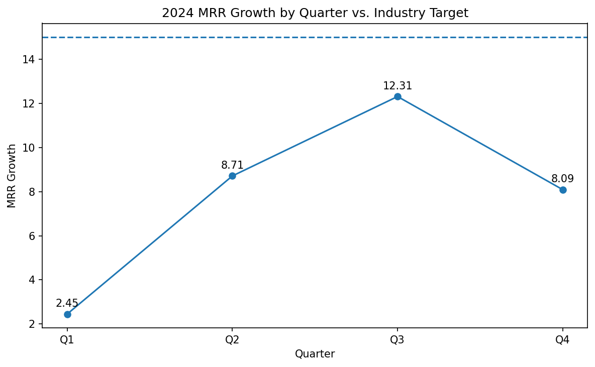

# SaaS Technology Performance Analysis — 2024 MRR Growth

**Role:** Senior Data Analyst · **Tooling:** LLM-assisted (ChatGPT Codex/Jules)  
**Contact:** 23f3000663@ds.study.iitm.ac.in

## Executive Summary
Our 2024 average monthly recurring revenue (MRR) growth is **7.89**, below the industry target of **15**. Performance improved from **Q1 2.45** to **Q3 12.31**, then dropped in **Q4 8.09**. The average gap to target is **7.11** points.

**Recommendation:** **Expand into new market segments** (primary lever) while improving activation and retention to stabilize growth.

## Data
- **Quarterly MRR Growth (2024):** Q1=2.45, Q2=8.71, Q3=12.31, Q4=8.09  
- **Average:** 7.89  
- **Industry Target:** 15

## Visual


## Key Findings
- **Acceleration then stall:** Growth rose to Q3 (12.31) but fell in Q4 (8.09).  
- **Sustained gap:** Average **7.89** vs target **15** → **-7.11** shortfall.  
- **Risk:** Q4 softness risks compounding if retention and segment fit are not addressed.

## Business Implications
- **Revenue planning:** At ~8 average growth, we underperform strategic goals, limiting reinvestment capacity.  
- **Concentration risk:** Current ICPs may be saturated; marginal acquisition is getting harder.  
- **Retention pressure:** Q4 dip suggests activation quality or value realization issues.

## Recommendations (prioritized)
1. **Expand into new market segments** (primary solution):  
   - Size and rank 2–3 adjacent ICPs by TAM, pain fit, and competitive pressure.  
   - Build segment-specific positioning, pricing, and onboarding flows.  
   - Pilot segment‑tailored demand gen; set success gates (win‑rate ≥ 20%, CAC/LTV ≥ 3).
2. **Activation & time‑to‑value:** Reduce onboarding friction (guided setup, templates).  
3. **Retention & monetization:** Usage-based nudges, success playbooks, upsell paths.  
4. **Experimentation cadence:** Monthly MVT on messaging, pricing pages, and in‑app prompts.

## Reproducibility
```bash
python -m venv .venv
# Windows
.venv\Scripts\activate
# macOS/Linux
# source .venv/bin/activate

pip install -r requirements.txt
python analysis.py
```

## Files in this PR
- `data/mrr_2024.csv` — quarterly MRR growth  
- `analysis.py` — loads data, prints metrics, outputs figure  
- `figures/mrr_trend_vs_target.png` — visualization  
- `README.md` — data story with findings, implications, and recommendations

## Notes on LLM Assistance
This analysis and documentation were prepared with LLM support (ChatGPT Codex/Jules). Commit messages can reflect that (e.g., `chore(codex): initial analysis`).